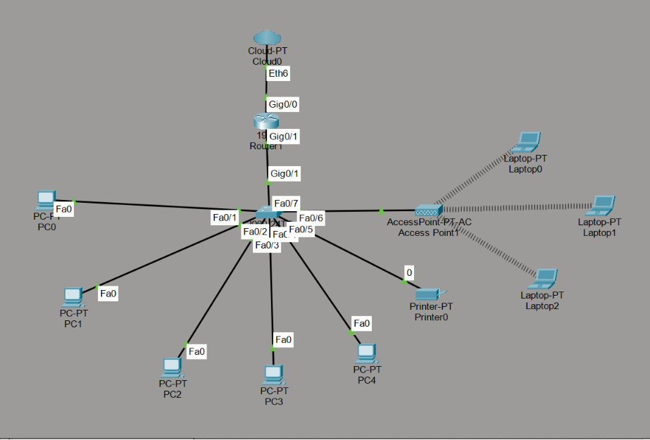
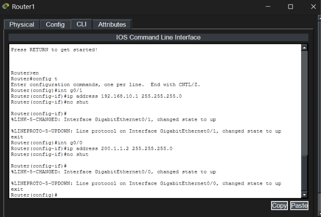
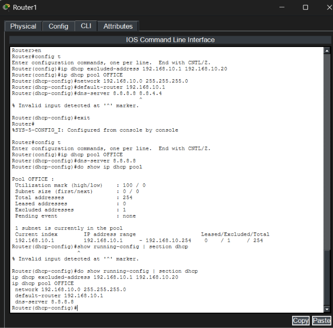
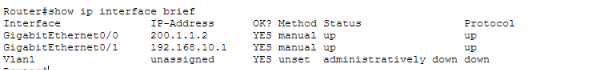
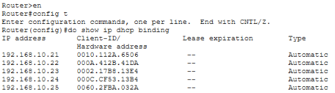

# SOHO-Network-Design-Lab
Designed and simulated a Small Office/Home Office (SOHO) network for a 10-user business using Cisco Packet Tracer, featuring DHCP, wireless connectivity, IP addressing, switch security, and end-to-end connectivity testing.

## Network Topology


*In this project the network follows a star topology, where all the other devices are connected to a central switch making it easier to manage, troubleshoot and expand. Devices connected to switch are end devices like PC, Printer and Access Point.* 

- Access Points are generally used for wireless connections for devices such as laptops and tablet although in this lab we've used laptop as the wireless device connected via signal to the AP. 
- The printer is shared across the network and hence provided static IP and configurations.
- Router acts like the default gateway and provides DHCP services to all the end devices or say client devices. 
- The ISP cloud is connected to the router to represent internet connectivity.

#### Device Count and Connections
- 1 × ISP Cloud (Cloud-PT)
- 1 × Cisco 1941 Router
- 1 × Cisco 2960 Switch
- 1 × Access Point-PT-AC
- 5 × Wired PCs
- 3 × Wireless Laptops
- 1 × Network Printer

#### Connections
- Cloud-PT (Eth6) → Router (GigabitEthernet0/0)
- Router (GigabitEthernet0/1) → Switch (FastEthernet0/7)
- Switch (FastEthernet0/1–FastEthernet0/5) → PCs (PC0–PC4)
- Switch (FastEthernet0/6) → Printer
- Switch → Access Point-PT-AC
- Access Point-PT-AC → Laptop0, Laptop1, and Laptop2 (wireless)

## Router Details
- Device: Cisco 1941 Router
- Role: Default Gateway, DHCP Server, and WAN Connectivity Provider
- LAN Network: 192.168.10.0/24
- WAN Network: Simulated ISP Connection

### Commands used in router CLI
**to enter global configuration mode**
```bash
en 
config t 
```
**configuring LAN interface**
```bash
int g0/1 
ip address 192.168.10.1 255.255.255.0 
no shut 
exit
```
**configuring WAN interface**
```bash
int g0/0 
ip address 200.1.1.2 255.255.255.0 
no shut 
exit
```
**reserve static IP addresses**
```bash
ip dhcp excluded-address 192.168.10.1 192.168.10.20
```
**configuring DHCP pool**
```bash
ip dhcp pool OFFICE 
network 192.168.10.0 255.255.255.0 
default-router 192.168.10.1 
dns-server 8.8.8.8 
exit
```
**to verify interface status in priviledged exec mode**
```bash
show ip interface brief
```

***to verify interface status in global configuration mode***
```bash
do show ip interface brief
```

**to verify DHCP pool**
```bash
show ip dhcp pool
```

**to verify DHCP leases**
```bash
show ip dhcp binding
```

**to save configuration**
```bash
copy running-config startup-config
```

<h3 align="center">Router Interface Configuration</h3>

<p align="center">
  
</p>

### Understanding the above commands
#to enter global configuration mode and configuring router's interfaces
- To move from User EXEC mode (>) to Privileged EXEC mode (#) we use en/enable as in this more you can view configurations and make administrative changes.
- To enter global configuration mode we write config t/configure terminal, this allows system-wide settings such as DHCP setup and interface configurations.
- Interface g0/1 serves as the default gateway since all the devices in the SOHO devices are connected to this router through switch. To activate the interface we use no shut/no shutdown.
- Interface g0/0 represnets router's connection to the internet.

<h3 align="center">DHCP Pool Setup</h3>

<p align="center">
  
</p>

#reserve static ip and creating DHCP pool
- Prevents the DHCP server from assigning addresses between 192.168.10.1 and 192.168.10.20 as these addresses are assigned to infrastructure devices such as the router, switch, and printer which require predictable addresses and should not receive dynamically assigned IP addresses.
- Creates a DHCP pool named OFFICE and specifies network address, default gateway and dns server. DHCP automatically provides IP configuration to client devices, reducing manual configuration and making the network easier to manage.
- show ip interface brief: Displays interface IP addresses and operational status to ensure interfaces are configured correctly.

<h3 align="center">Interface Brief</h3>

<p align="center">
  
</p>

- show ip dhcp pool: Displays DHCP pool information, including available and leased addresses.

<h3 align="center">DHCP Bindings</h3>

<p align="center">
  
</p>

- show ip dhcp binding: Displays all client devices that have obtained IP addresses from the DHCP server.
#save the Configuration
- copy running-config startup-config: saves the active configuration to NVRAM. Without saving, all configurations would be lost after a router reboot or power failure.

## Switch Configuration and Explanation
### Device Details
- Device: Cisco Catalyst 2960 Switch
- Role: LAN Access Switch
- IP Address: 192.168.10.2
- Provides connectivity for PCs, Printer, and Access Point

### Switch Configuration

Click **Switch → Command Prompt**

### 1. Enter Configuration Mode
```bash
enable
configure terminal

### 2. Set Hostname
```bash
hostname SW1
```
### 3. Set Console Password
```bash
line console 0
password cisco
login
exit
```
### 4. Encrypt password
```bash
service password-encryption
```

### 5. Configure Management IP
```bash
interface vlan 1
ip address 192.168.10.2 255.255.255.0
no shutdown
exit
ip default-gateway 192.168.10.1
```

### 6. Disable Unused Ports
```bash
interface range fa0/8-24
shutdown
exit
```

### 7. Save Configuration
```bash
end
copy running-config startup-config
```

### 8. Verify Interfaces
```bash
show ip interface brief
```

