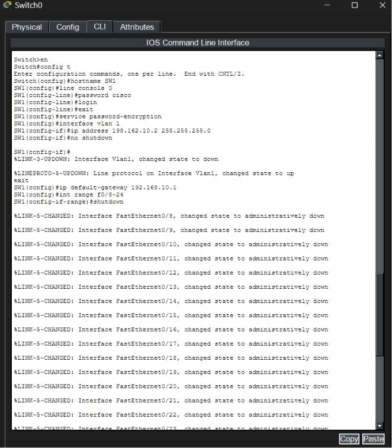
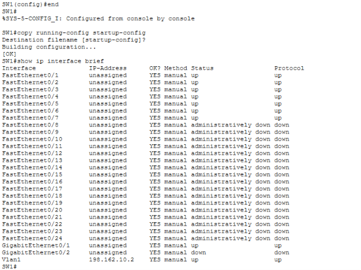

# Switch Configuration and Explanation
## Device Details
- Device: Cisco Catalyst 2960 Switch
- Role: LAN Access Switch
- IP Address: 192.168.10.2
- Provides connectivity for PCs, Printer, and Access Point

## Switch Configuration

Click **Switch → Command Prompt**

### 1. Enter Configuration Mode
```bash
enable
configure terminal

### 2. Set Hostname
```bash
hostname SW1
```
### 3. Set Console Password
```bash
line console 0
password cisco
login
exit
```
### 4. Encrypt password
```bash
service password-encryption
```

### 5. Configure Management IP
```bash
interface vlan 1
ip address 192.168.10.2 255.255.255.0
no shutdown
exit
ip default-gateway 192.168.10.1
```

### 6. Disable Unused Ports
```bash
interface range fa0/8-24
shutdown
exit
```

### 7. Save Configuration
```bash
end
copy running-config startup-config
```

### 8. Verify Interfaces
```bash
show ip interface brief
```

### Understanding the above commands
<h3 align="center">Switch CLI Configuration(Security + Management)</h3>

<p align="center">

</p>

**to configure basic switch security and management setup**

- To move from User EXEC mode (>) to Privileged EXEC mode (#) we use *en / enable*, which allows viewing and performing administrative configurations on the device.
- To enter global configuration mode we use *config t / configure terminal*, which enables system-wide configuration such as hostname, passwords, and interface settings.
- *hostname SW1* sets a professional device name for easy identification in the network topology and documentation.
- *line console 0 + password cisco + login* secures console access by requiring a password before allowing local device access through the console port.
- *service password-encryption* encrypts all plain-text passwords in the configuration file to improve basic security and prevent easy exposure of credentials.
- *interface vlan 1 + ip address* assigns a management IP address to VLAN 1, which allows remote access (such as SSH/Telnet) to manage the switch.
- *no shutdown* activates the VLAN interface so it moves from administratively down to up state and becomes operational.
- *ip default-gateway* defines the router IP address used for managing traffic outside the local network, enabling remote management access.
- *interface range fa0/8-24 + shutdown* disables unused switch ports to reduce security risks such as unauthorized device connections and network attacks.

<h3 align="center">Switch Save & Verification</h3>

<p align="center">

</p>

**to save configuration and verify switch status**

- *copy running-config startup-config* saves the current active configuration (running configuration) into NVRAM (startup configuration), ensuring that all changes are preserved after reboot or power failure.
- Without saving the configuration, all changes made during the session would be lost once the device is restarted.
- *show ip interface brief* displays a summary of all interfaces, including their IP addresses and operational status.
- It is used to quickly verify that VLAN 1 is active and that unused ports are in an administratively down state for security and proper configuration validation.


